# The Joe Engine

[](https://ci.appveyor.com/project/klingerj/joe-engine)
[](https://travis-ci.com/klingerj/Joe-Engine)

The goal of the Joe Engine is to be my C++ playground. The engine will contain various engine programming experiments and features related to rendering, systems, and performance.  

### Index
* [Documentation](#documentation)
* [Engine Features](#features)
* [Build Instructions](#build-instructions)
  * [Windows](#windows)
  * [MacOS](#macos)
* [Dependencies](#dependencies)
* [Resources](#resources)
* [Assets](#assets)

### Documentation
View the docs [here](https://klingerj.github.io/html/).

### Features
##### Deferred renderer
The JoeEngine renders all opaque geometry via [deferred rendering](https://en.wikipedia.org/wiki/Deferred_shading). The first pass of deferred rendering renders all geometry to 3 G-buffers:

|Albedo|Depth|Normal|
|:----:|:----:|:----:|
|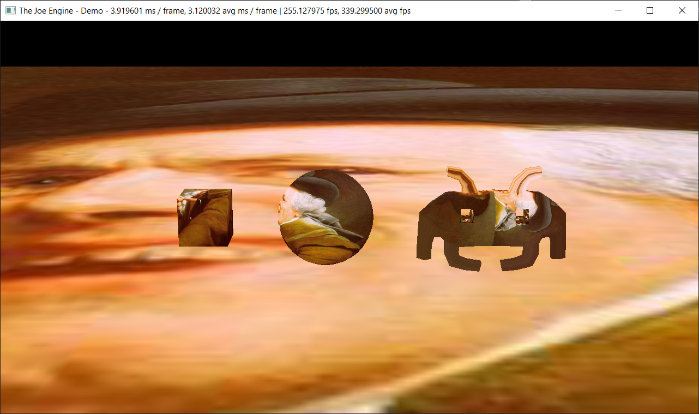|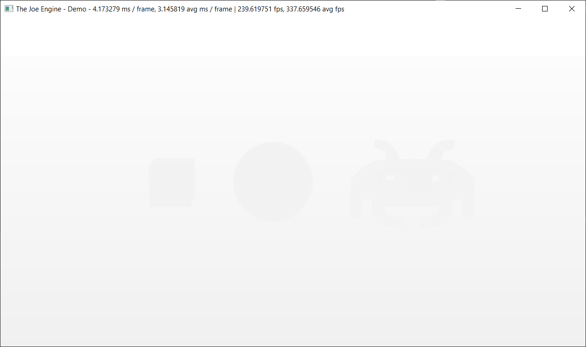|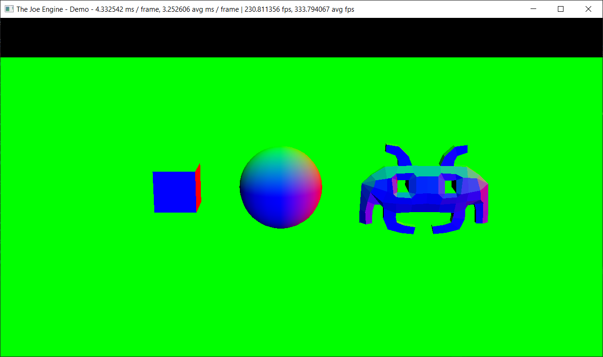|

The second pass takes the above G-buffers as input textures and computes all lighting and shading. The final image resulting from the above G-buffers would look like this:  
  
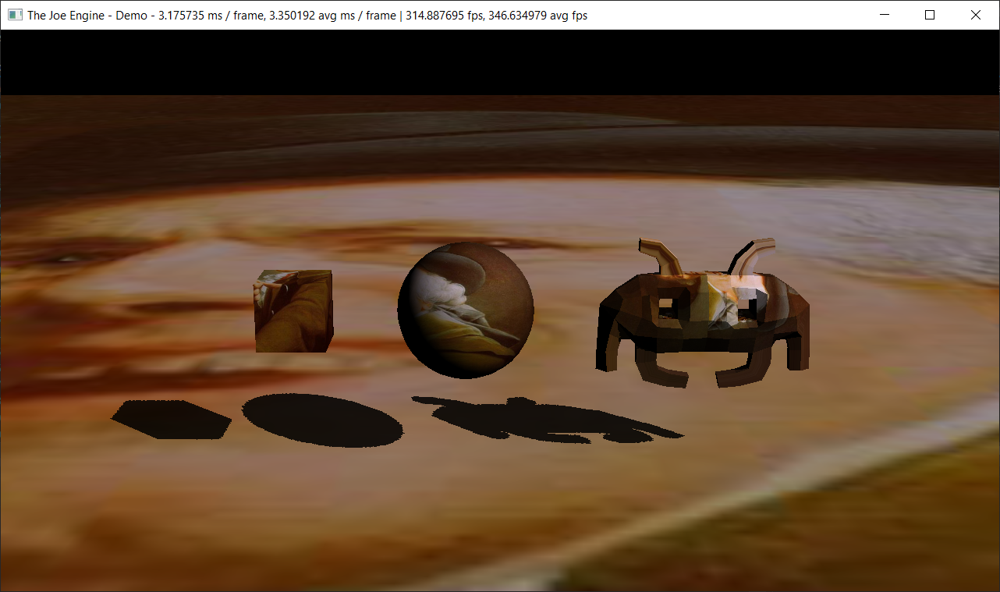

This particular deferred lighting pass computed lambertian shading and shadows (see the [Shadow Mapping](#shadow-mapping) section).

##### Instanced rendering
The JoeEngine seeks to minimize the amount of GPU draw calls in the main render loop. Every frame, before any draw calls are made, a master list of scene entities are sorted by Mesh Component (see the [Entity-Component System](#data-oriented-entity-component-system) section below). This allows the engine to render multiple meshes in a single draw call by simply specifying a number of entity instances.  
  
Example of instanced draw calls:  
  


Note: The Joe Engine also performs additional sorting by material properties. This is detailed in the [Material System](#material-system) section.

##### Shadow mapping
To accomplish the rendering of shadows, the Joe Engine uses typical shadow mapping. This occurs with two render passes. The first pass renders all shadow-casting entities to a shadow map, using an orthographic projection from the scene’s light source. This yields a depth texture representing the shadow-casting fragments that are closest to the light source. Such a shadow map might look like this:  
  
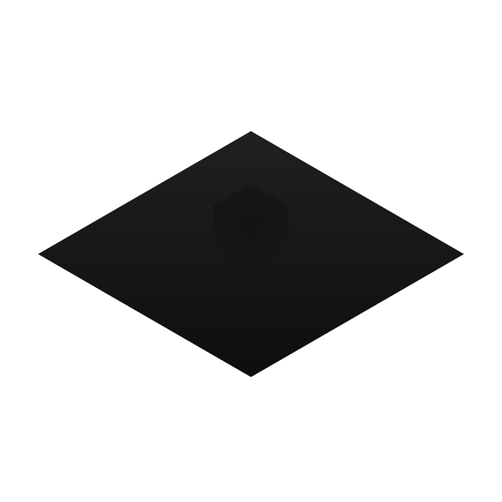

This shadow map is used during the shading step of the deferred rendering pipeline. To determine if a particular fragment lies in shadow, we use the same orthographic projection to determine that fragment’s depth (distance) relative to the light source. If that depth is further from the light source than the value stored in the shadow map (at the same shadow map texel), the fragment is considered in shadow, and is shaded as such:

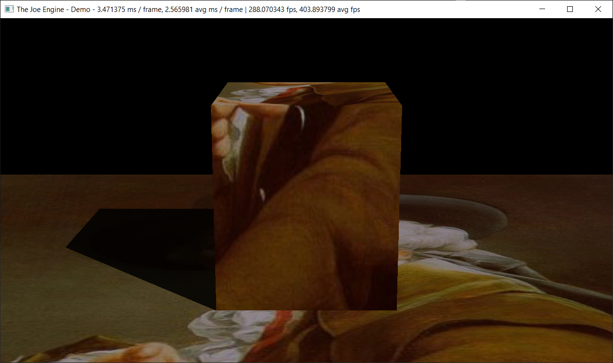

No filtering techniques (e.g. PCF) are used to create soft shadows (a future task).

##### Frustum culling
Another way that the Joe Engine attempts to reduce the number of GPU draw calls made is by ignoring entities whose mesh components lie entirely outside of the rendering camera’s view frustum. This is done by perspective-projecting the eight corners of each mesh’s bounding box (the Joe Engine uses oriented bounding boxes, or OBBs) into normalized device coordinates, where the bounding box’s resulting x and y position values lie on [-1...1] if onscreen. If these projected coordinates lie outside of this value range, the mesh is considered offscreen, meaning that no GPU draw call will be made.  
  
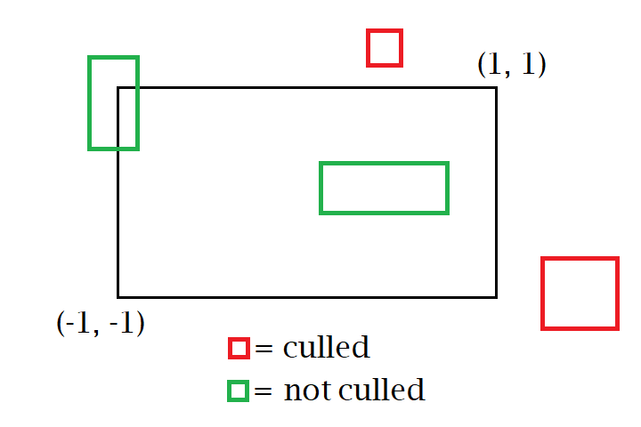

##### Order-independent translucency (OIT)
Rendering of translucent materials (where alpha < 1, in other words, not fully opaque) can be difficult as the blending function is not commutative- objects must be rendered in a particular order (typically back-to-front with respect to the camera). This works, but does not solve the issue of the correct rendering of intersecting/overlapping translucent triangles.  
  
There are many ways to go about accomplishing this. [This](http://researchbank.rmit.edu.au/view/rmit:161520) thesis paper by Pyarelal Knowles (also listed in the [Resources](#resources) section) gives excellent background on the topic and describes the various implementation options well. The Joe Engine implements the linked-list solution described in section 3.3, but does not include many of the further optimizations and improvements described later in the paper.  
  
This permits the Joe Engine to issue GPU draw calls of translucent objects in any order while still outputting the correct result. The following example scene, consisting of two intersecting translucent triangles, exemplifies the utility of this feature.  
  
Here is the scene as rendered in Autodesk Maya, to make the orientation of the triangles clear:  
  
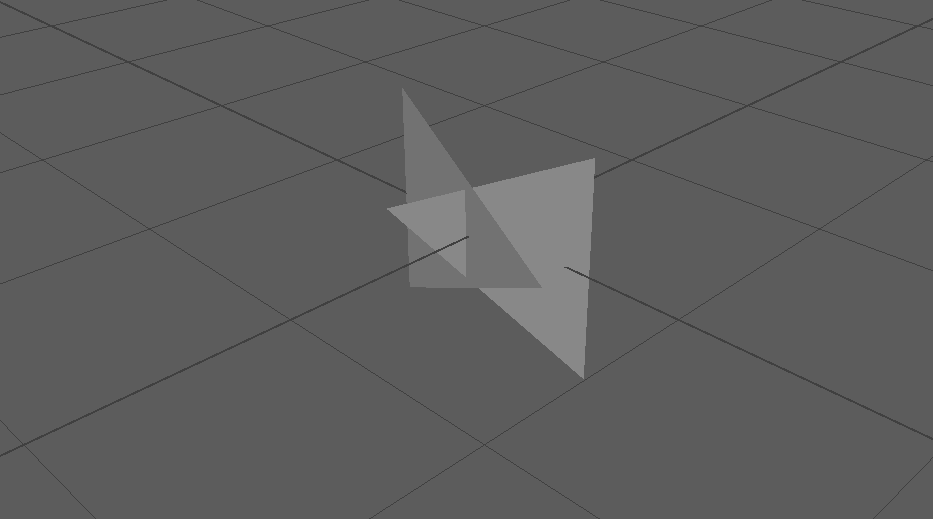

Without OIT enabled, the triangles must be drawn one after the other, resulting in an image like this:  
  
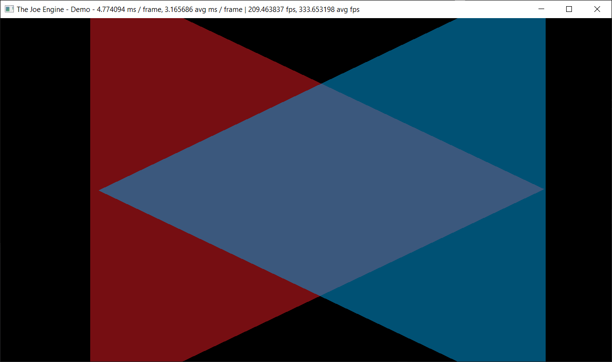

Obviously, the colors are not blending properly, as blending is taking place per-draw call. Intersecting triangles require proper blending per-fragment, which the OIT implementation in the Joe Engine accomplishes, resulting the following, correct image:

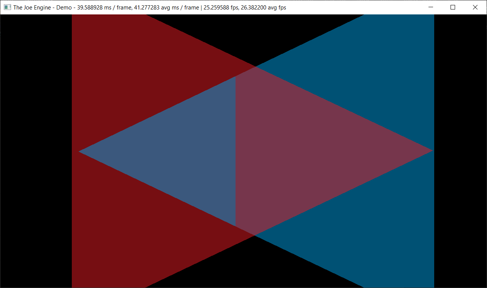

##### Data-oriented entity-component system
To empower the user to create a more customizable/programmable scene, the Joe Engine provides an entity-component system (similar to the paradigm used in the Unity engine). The user can implement custom functionality by creating a new 'Component' type. These Components are then ‘attached’ to an entity and are generally updated each frame. This way, the user can create program their own gameplay features.  
  
The data-oriented aspect of this feature lies with the considerations made for the memory layout of the entities and components. A common approach to creating an entity-component system would be to have each entity ‘own’ each of its components; conceptually, this arrangement:  
  
  ```
  class Entity {
    list<Component> m_components;
  };
  ```  
  
The problem is that this object-oriented approach has negative implications for performance, particularly with cache usage. With a memory layout like the above, a single operation on an entity (say, update Component ‘A’) will likely bring each of its other Components (say, 'B' and 'C') into memory as well. This is undesirable if our goal is to, say, update every instance of Component A in the scene - every memory access to the entity’s Component A will also bring Components B and C into memory. This is poor usage of the cache- ideally, the cache would contain instances of Component A and nothing else.  
  
So, the Joe Engine uses different memory layout. The Joe Engine owns multiple component-managers, which are simple classes that manage a master list of all instances of a particular component type. This master list is a data-structure that stores every component in linear, contiguous memory, which is highly cache-friendly. This data structure, the ‘[PackedArray](https://klingerj.github.io/html/class_joe_engine_1_1_packed_array.html)’, is based on a [blog post](http://bitsquid.blogspot.com/2011/09/managing-decoupling-part-4-id-lookup.html) from [Bitsquid](https://en.wikipedia.org/wiki/Bitsquid). This data structure allows for the addition/removal of elements (Components) from their assigned entities while keeping all active Components close together in memory.  
  
Now that all Components reside in the ideal memory layout, we can rest assured that when we iterate over each component to update it, the engine's performance will not be bogged down by unnecessary, CPU cycle-heavy memory loads.  
  
The Joe Engine provides several core components, namely [Mesh](https://klingerj.github.io/html/class_joe_engine_1_1_mesh_component.html), [Material](https://klingerj.github.io/html/class_joe_engine_1_1_material_component.html), and [Transform](https://klingerj.github.io/html/class_joe_engine_1_1_transform_component.html). As a sample custom component type, a ‘[RotatorComponent](https://klingerj.github.io/html/class_rotator_component.html)’ is also provided. A RotatorComponent constantly rotates an entity about a specified axis:  
  
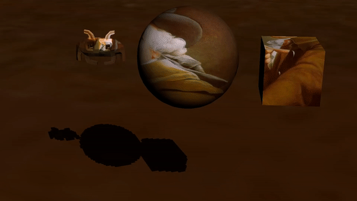

##### Material system
To allow for more authorable materials, the Joe Engine offers a simple material system. This allows the user to specify properties such as render layer, opacity/translucency, whether it casts shadows, shaders, and source textures while letting the engine take care of API-specific function calls. Additionally, the Joe Engine will ensure that all API-specific shader resource binding function calls (e.g. descriptor set binding) are performed the optimal amount of times by sorting all entities by their material properties by how frequently they change. As mentioned in the Instanced rendering section, the engine will then further sort each of these individual “material groups” of entities by mesh component.  
  
Below are two entities with separately authored materials:  
  
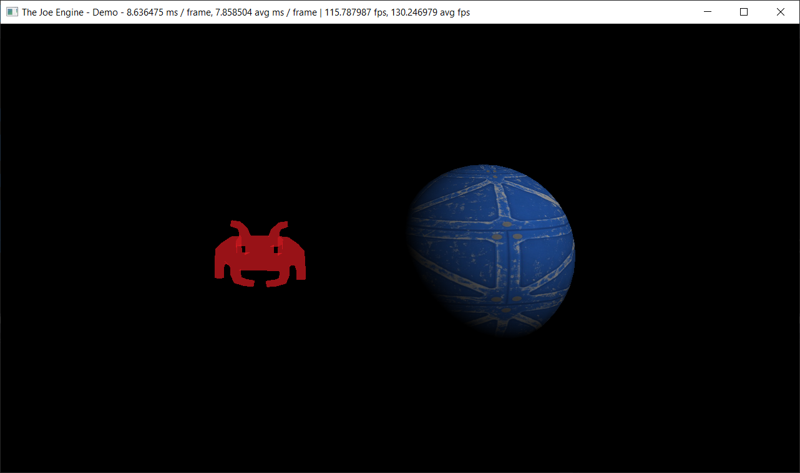
Left: Translucent, red. Right: opaque, texture-mapped.

##### Threadpool
To assist with the multi-threading of large tasks, the JoeEngine offers a thread pool (see the [ThreadPool](https://klingerj.github.io/html/class_joe_engine_1_1_j_e_thread_pool.html) class in the documentation). The user must first specify some data and a function for the thread to execute - this constitutes a thread task. The thread pool class API offers functions for easily queueing up such tasks to be executed. The threads in the pool are launched once during engine start-up and block until a new task is enqueued. It is up to the user to break up their own workloads into tasks for the thread pool.

##### CPU particle emitter systems
The Joe Engine provides particle emitter systems to the user. These particle systems spawn a set amount of particles with a specified lifetime which respawn at the source after death. The user can also specify a material component to attach to these systems to customize the look of the particles.  
  
The Joe Engine performs physics integration entirely on the CPU using discrete time steps - generally, once every 16.67 milliseconds, or at 60 frames per second. The Joe Engine provides both single- and multi-threaded implementations of the integration code as well as various other implementations that make use of the CPU’s intrinsics (e.g. AVX or AVX2).  
  
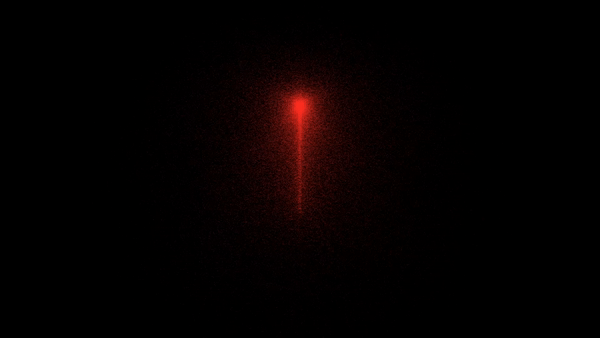

##### Post-processing
(Deprecated/inactive for now)
##### (Buggy) rigidbody simulation
(Deprecated/inactive for now)

### Build Instructions
Regardless of platform, you will need to install the following software:  
[Vulkan SDK](https://vulkan.lunarg.com/) (latest)  
[CMake](https://cmake.org/) (3.15.1 or higher)  
[Microsoft Visual Studio](https://visualstudio.microsoft.com/downloads/) (2017 or later)  

Once these are all installed properly, continue with the build instructions.

#### Windows
1. Download the above zip file containing the Joe Engine repository. Extract it.
2. You will need to open a Command Prompt or other shell program (e.g. I like to use Git Bash) in the top-level directory of the project (Folders like Build/, Source/, ThirdParty/, etc should be visible).
3. Execute the following command: `cd Build && cmake-gui ..`
4. You should now be presented with the CMake GUI. Set the Source directory to `/YourPath/Joe-Engine-master` and the Binaries directory to `/YourPath/Joe-Engine-master/Build`.
5. Click Configure. Choose the latest Visual Studio Generator. Be sure to select the optional argument 'x64' from one of the dropdown menus.
6. Click Generate. Assuming that works without issue, open the project with Visual Studio.
7. You should now be viewing the JoeEngine solution in Visual Studio. To test, choose to build in Release mode, then build the solution. Note that you will need a Wi-Fi connection in order for the project to download the JoeEngine's various dependencies from their respective Github repositories. After building successfully, right-click on the JoeEngine project in the Solution Explorer, and click 'Set as Startup Project'.
8. Run the project.

#### MacOS
1. Download the above zip file containing the Joe Engine repository. Extract it.
2. You will need to open a Cmd or other shell program in the top-level directory (You should be able to see folders like Build/, Source/, ThirdParty/, etc.).
3. Execute the following command: `cd Build && cmake-gui ..`
4. You should now be presented with the CMake GUI. Set the Source directory to `/YourPath/Joe-Engine-master` and the Binaries directory to `/YourPath/Joe-Engine-master/Build`.
5. Click Configure. Choose either the Ninja or XCode Generator.
6. Click Generate. Assuming that works without issue, open the project with XCode, or build the project from the command line with Ninja.
7. If using XCode IDE, open the project with XCode and build using the GUI. If using Ninja, once you build the project, you should be able to simply run the JoeEngine executable.

### Dependencies
[Vulkan SDK](https://www.lunarg.com/vulkan-sdk/)  
[GLFW](http://www.glfw.org/)  
[GLM](https://github.com/g-truc/glm/releases)  
[Tiny OBJ Loader](https://github.com/syoyo/tinyobjloader)  
[STB Image Loading](https://github.com/nothings/stb)  

### Resources
[Vulkan Tutorial](https://vulkan-tutorial.com/)  
[Sascha Willems Vulkan C++ examples and demos](https://github.com/SaschaWillems/Vulkan)  
[ARM Software Vulkan SDK Samples](https://github.com/ARM-software/vulkan-sdk)  
[Real-Time Collision Detection by Christer Ericson](https://realtimecollisiondetection.net/)  
[Gaffer on Games](https://gafferongames.com/)  
[Unconstrained Rigidbody Physics by David Baraff, Siggraph course notes](https://www.cs.cmu.edu/~baraff/sigcourse/notesd1.pdf)  
[Real-Time deep image rendering and order independent transparency by Pyarelal Knowles](http://researchbank.rmit.edu.au/view/rmit:161520)  
[Molecular Musings](https://blog.molecular-matters.com/)  
[Crunching numbers with AVX](https://www.codeproject.com/Articles/874396/Crunching-Numbers-with-AVX-and-AVX)  

### Assets
[Metal PBR Texture](https://3dtextures.me/about/)  
